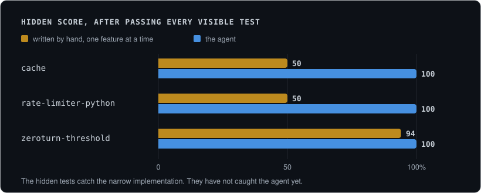

# specgap

[](https://github.com/cris-wendler/specgap/actions/workflows/ci.yml)
[](go.mod)
[](go.mod)
[](LICENSE)

Give a coding agent a task and some tests. Keep a second set of tests
hidden. Grade it on both, and look at the difference.


## Try it

```sh
go install github.com/cris-wendler/specgap/cmd/specgap@latest
specgap run cache --agent "claude -p 'Read SPEC.md and make the tests pass'"
```

`run` prepares a workspace, starts the agent in it, grades what it left
behind, and throws the workspace away. The tasks travel inside the
executable, so this works from any directory.

```text
SPECGAP
task     cache
visible  100%  8 of 8   the tests the agent could see
hidden    50%  3 of 6   the tests it could not
gap       50 points  in 0s
work     1 file changed, 39 lines in, 0 lines out
failed on what it never saw:
  TestExpiryRecencyAndCapacityTogether
  TestLenDoesNotCountExpiredEntries
  TestReadingAnExpiredEntryIsNotAUse
```

That output is from `testdata/naive.go.txt`, an implementation written
one feature at a time. It is not an agent run.

Needs Go 1.17 or newer and nothing else. A Python task also needs
`pytest`.

## What it found so far



Nine agent runs so far, and every one scored full marks on both suites.
The hidden tests do catch an implementation written feature by feature.
They have not caught the agent, because the agent does not write that
implementation: it reads the surrounding code first.

Two of the five say nothing, because of mistakes in the task rather
than anything the agent did. [docs/results.md](docs/results.md) has the
full account, including a real defect this found in another project.

## The idea

A test suite usually checks one feature at a time, and an agent works
until it passes. So the code can be green and still wrong where two
features meet, because no test asked.

The hidden tests add no features. They only ask about those meeting
points. In the cache task an expired entry must not hold a slot, must
not be counted, and must not win a recency comparison. None of that is
in the visible tests.

Read the list of failed tests, not the percentage. The two suites are
different sizes, so one failure out of fourteen shows as seven points and
can still mean a feature is unreachable.

## The tasks

| Task | What it is |
| --- | --- |
| `cache` | A cache with expiry and a size limit, in one Go file. A current model scores 100 on both suites, because this problem is in every textbook. Kept here because that is a finding too. |
| `rate-limiter-python` | A per key rate limiter with a window and a burst, graded through pytest. Eight visible tests, six hidden. |
| `zeroturn-threshold` | A real repository at a fixed commit, about 500 tests. The job is to add one configuration setting. The hidden tests were not written for this: they exist in that project because changes like this one shipped broken. |

For `zeroturn-threshold`, three levels of work were written by hand to
check that the task tells them apart. All three pass every one of the
521 visible tests:

| The work | Hidden | What it still gets wrong |
| --- | --- | --- |
| nothing done | 17 of 20 | the setting has no default and the gate never reads it |
| the type, the default, the gate, and the file the README shows | 17 of 20 | the setting is in neither the key registry nor the published schema, so nobody can see or change it |
| the reference solution | 20 of 20 | |

The middle row is why the task exists. It is a complete, reviewable
change that passes every test its author could run, and the feature
cannot be reached from the command line.

The first two rows also score the same and fail entirely different
tests. The number cannot tell those two pieces of work apart. The list
of failures can, which is why the report prints it.

That task needs the other repository next to this one. `SPECGAP_REPO`
points at it if you keep it somewhere else, and without it the task says
so and its tests skip.

```sh
git clone https://github.com/cris-wendler/zeroturn
git clone https://github.com/cris-wendler/specgap
```

## Commands

| Command | What it does |
| --- | --- |
| `specgap tasks` | list the tasks |
| `specgap run <task> --agent <command>` | prepare, run the agent, grade, and report |
| `specgap prepare <task> <dir>` | write a workspace holding only what the agent may see |
| `specgap grade <task> <dir>` | run both suites and report both scores, `--json` for a script |

Options for `run`:

| Option | What it does |
| --- | --- |
| `--runs <n>` | repeat the attempt in fresh workspaces and report the lowest, median and highest hidden score, with how often each hidden test failed |
| `--results <file>` | append each attempt as a line of JSON |
| `--keep <dir>` | leave the workspaces behind to look at |
| `--timeout <duration>` | give up on an agent that never returns. Thirty minutes by default, `0` for no limit. The attempt is still graded and recorded as `timedOut` |

The `work` line in the report says what the attempt changed in the
workspace. It is read before grading starts, so the hidden tests are
never counted as the agent's work.

Hidden tests are planted to grade and removed afterwards, so a workspace
an agent can read never contains them. `SPECGAP_TASKS` sets where the
tasks live if you run the command from somewhere else. A checkout takes
priority over the built in tasks, so editing a task needs no rebuild.

## Adding a task

A task is a directory under `tasks/` with a `task.json`, a `SPEC.md` and
the tests. Set `runner` to `pytest` for a Python task; leaving it out
means Go. `tasks/cache` is the short form, and `tasks/zeroturn-threshold`
is one cut from a repository.

Two rules keep a task fair, and the test suite enforces both:

- Every task ships the change that solves it, and that change must score
  full marks. A hidden test that asks for something the specification
  never said fails here, not in an agent's score.
- An untouched workspace is graded too, and it has to fail.
